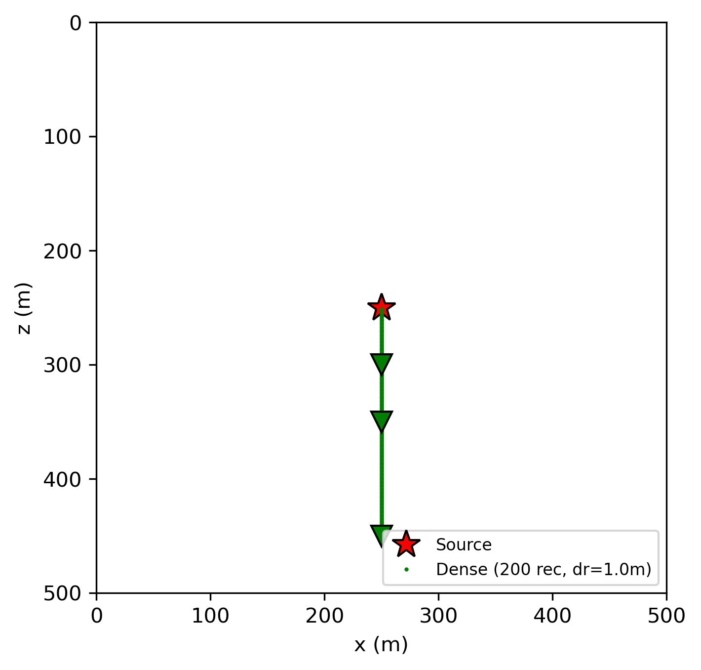
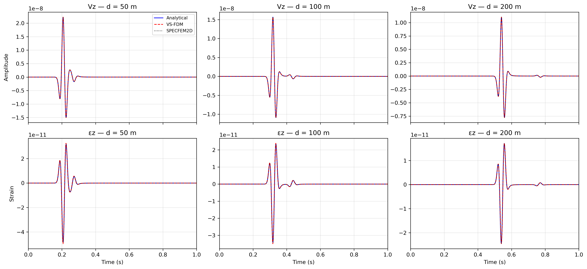
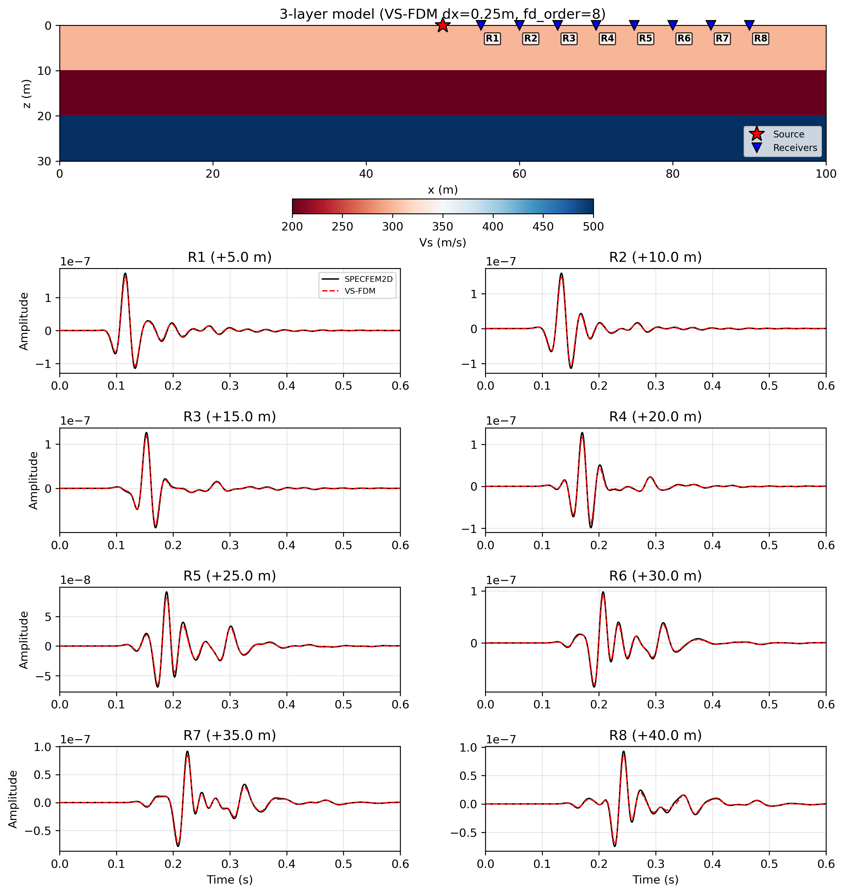

# Strain FWI — Elastic Full Waveform Inversion on Marmousi II

Velocity-strain staggered grid Finite Difference Method (VS-FDM) for 2D Elastic Full Waveform Inversion (FWI), implemented in JAX (Just-in-time JIT compile).

Inverts S-wave velocity (Vs) on the Marmousi II model.

## Overview

- **Model**: 2D elastic Marmousi II (water layer and top 200 m removed)
- **Size**: 3040 m (depth) × 10000 m (width) → 152 × 500 grid, `dx = dz = 20 m`
- **Framework**: JAX (automatic differentiation, GPU-accelerated)
- **Optimizer**: L-BFGS
- **Strategy**: multiscale (low-to-high frequency) inversion of Vs

## Repository structure

```
Demo_FWI/
├── Main_ex_Vs.py           # Main driver script (run this)
├── fwi/                    # Core FWI package
│   ├── forward.py          # Elastic forward modeling
│   ├── loss.py             # Misfit / objective function
│   ├── optimizer.py        # L-BFGS wrapper
│   ├── illumination.py     # Source illumination preconditioner
│   ├── filters.py          # Bandpass / low-pass filters
│   ├── taper.py            # Source taper
│   └── plots.py            # Diagnostic plotting utilities
├── marmousi_models/        # True and initial Vp / Vs / rho (.npy)
└── Results_ex_Vs/          # Output figures and inverted models
```

## Requirements

- Python 3.10+
- JAX (with CUDA support for GPU)
- NumPy, SciPy, Matplotlib

```bash
pip install "jax[cuda12]" numpy scipy matplotlib
```

## Usage

```bash
python Main_ex_Vs.py
```

GPU device and memory fraction are configured at the top of `Main_ex_Vs.py`:

```python
os.environ["CUDA_VISIBLE_DEVICES"] = "5"
os.environ["XLA_PYTHON_CLIENT_MEM_FRACTION"] = "0.9"
```

Results (figures + checkpoints) are written to `Results_ex_Vs/elastic_FWI/`.

Note: This project is designed to run on GPU using JAX. However, due to the high memory demand of elastic Full Waveform Inversion (FWI), proper configuration is required. Author used L40S GPU.

## Validation

Validation of the elastic forward solver against reference solutions.

### Acquisition geometry
3 receivers and an array to take derivative for strain.



### Wavefield snapshots


### Waveform comparison — all receivers



### Vz validation against Specfem2D



### Backward (adjoint) wavefield

Hand-coded discrete adjoint of the production forward (`fwi/adjoint_jax_kernel.py`),
verified by a dot-product test (`test_adjoint_kernel.py`) at machine precision
(rel diff ≤ 1.78 × 10⁻¹⁵) across `fd_order ∈ {2, 4, 8}`,
`free_surface ∈ {False, True}`, and `src_type ∈ {'force', 'moment'}`.
The animation below shows the four backward-propagating fields
(`Vx`, `Vz`, `εxx`, `εzz`) on a homogeneous half-space, generated by `tmp.py`.


## Author

Minh Nhat Tran — April 2026
